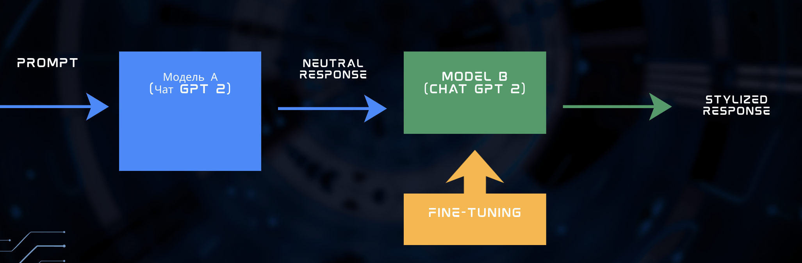

# botiara

The project aims to develop a chatbot capable of imitating a specific person's unique writing style, moving beyond the generic and robotic responses of standard AI. Primary task is to use an exported chat form Telegram to train model.

### Aim
The main idea of ​​the project was to develop a chat bot that would communicate with you in the style of a certain user, in our case we chose Trump.

### DATA

So it all started with a study of competitors who had already done similar projects, we left links to them below. The main problem of our project was the data, we found a dataset on Kagli in which there were about 10 thousand. Trump phrases, but we could not train our model purely on their phrases. Therefore, using the Open ai API, we created a neutral phrase corresponding to each Trump tweet. Thus, after cleaning from incorrect phrases for various reasons, we were able to get about 5 thousand pairs, which were subsequently used to train the models.

### Pipeline

Our pipeline consists of two models (initially chat gpt 2-small), the first model receives a prompt, which is our appeal to the bot, and issues its response, we also have a second model, which catches the response from the first model and simply styles it to the style of our user. As you might guess, our main work will be tied to the second model, it is it that we will fine-tune. It is also worth noting that using the chat gpt2-small model, in order to adapt it purely for rewriting, we give it a prompt rewrite and after that, we already see the generation style of the second model. However, the results for chat gpt-2 small were not good enough, so we moved on to the next point of our work.

### Moving to larger models

So the results on the chat gpt 2 small were quite weak, we saw that it was already rewriting the text in Trump's style, but there were still a lot of problems with generating the answer, they were like a random set of words, and not a reaction to our message, albeit in Trump's style. Therefore, we decided, since we already used the OPENAI API, that for the first model that would give an answer, we switched to the newest chat gpt 5.2 model. Now we saw that the model answered our questions very clearly and correctly, but it still often answered with large texts, which in our opinion did not look like a real dialogue, so we gave it a system prompt to answer with short phrases, which in turn are much easier for our stylist model to catch, because we trained it on tweets that were not much longer than 2 sentences. Regarding the changes to our stylist model, we switched to a larger model, chat gpt 2 medium, if compared to the small one, it has almost 400 million parameters, while the small one has about 100. However, training all 400 million parameters will be quite time-consuming and not always effective. Therefore, we decided to use Lora, which allows us to train not all 400 million parameters, but about 5 million, while our model successfully captures the style of writing text in the style of Trump.

### Livechating 

So we implemented live chatting in this way, first we send a prompt to the chat gpt 5.2, which gives us an answer and passes it to the stylist, which in turn gives us the already rewritten text, a kind of conveyor. We also stuffed everything into loops, so it works in real time and responds immediately when we address it. Also, for clarity, we return neutral text, which gives us the chat gpt 5.2 and its already stylized version.

### Metriks Results

We used metrics to study the correctness of rewriting our text in the Trump style. It was also very important for us to use metrics to see the improvement of the transition to a larger model. After testing the old rewriter model and the larger new one, we found that on the test part of the dataset, the results qualitatively increased, which showed us that what we really needed was a larger model.

### Conclusion

During the work, we managed to build a full-fledged pipeline of two models, which works correctly, but it is worth saying that the chat simply responds in Trump's style, and does not broadcast his thoughts, because we rewrite the response of a simple model, the chat gpt, and it also cannot answer questions about personal thoughts, about a person, which would show the phrases most characteristic of him.

### The resources and links we use to do the project:

https://pub.towardsai.net/chatgp-me-building-a-telegram-bot-clone-with-openais-gpt-ffd1c516cc96 -  Medium blog
https://www.sciencedirect.com/science/article/pii/S2666651024000135 - Chinese research

Additional, but not main researches:
https://arxiv.org/abs/1905.10060?
https://arxiv.org/abs/1901.09501?
https://arxiv.org/abs/2003.04993?
